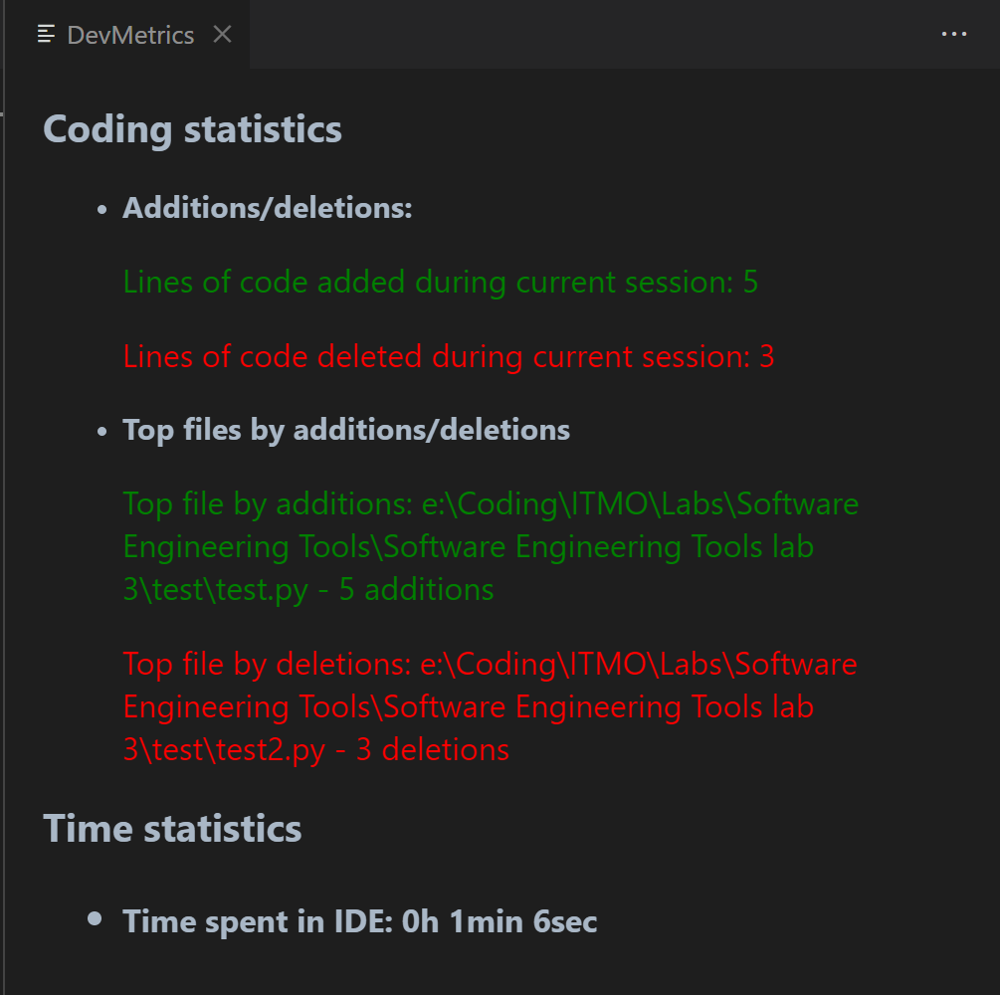

# devmetrics README

DevMetrics is a VS code extension that allows you to track your developer statistics right in your IDE.

## Features

Current features are:
- Tracking of additions and deletions in active files
- Tracking of the most modified files

## Usage

Just enter ">Show DevMetrics data" command!