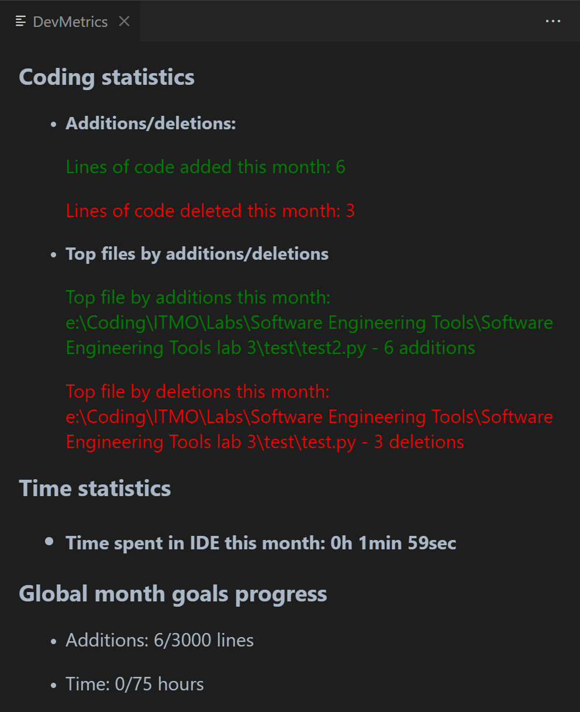

# devmetrics README

DevMetrics is a VS code extension that allows you to track your developer statistics right in your IDE.

## Features

Current features are:
- Tracking of additions and deletions in active files
- Tracking of top files by additions\deletions
- Tracking of time spent in IDE
- Metrics data storage between VS Code sessions

## Usage

- To see the metrics, type in "Show DevMetrics data" command
- To reset the metrics to their default values, type in "Reset DevMetrics data" command